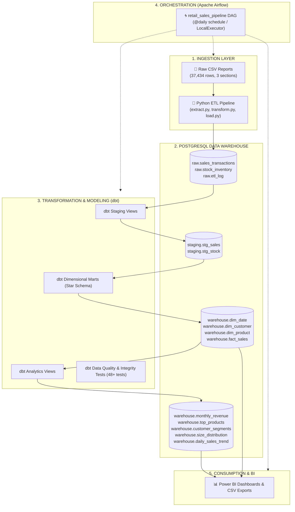
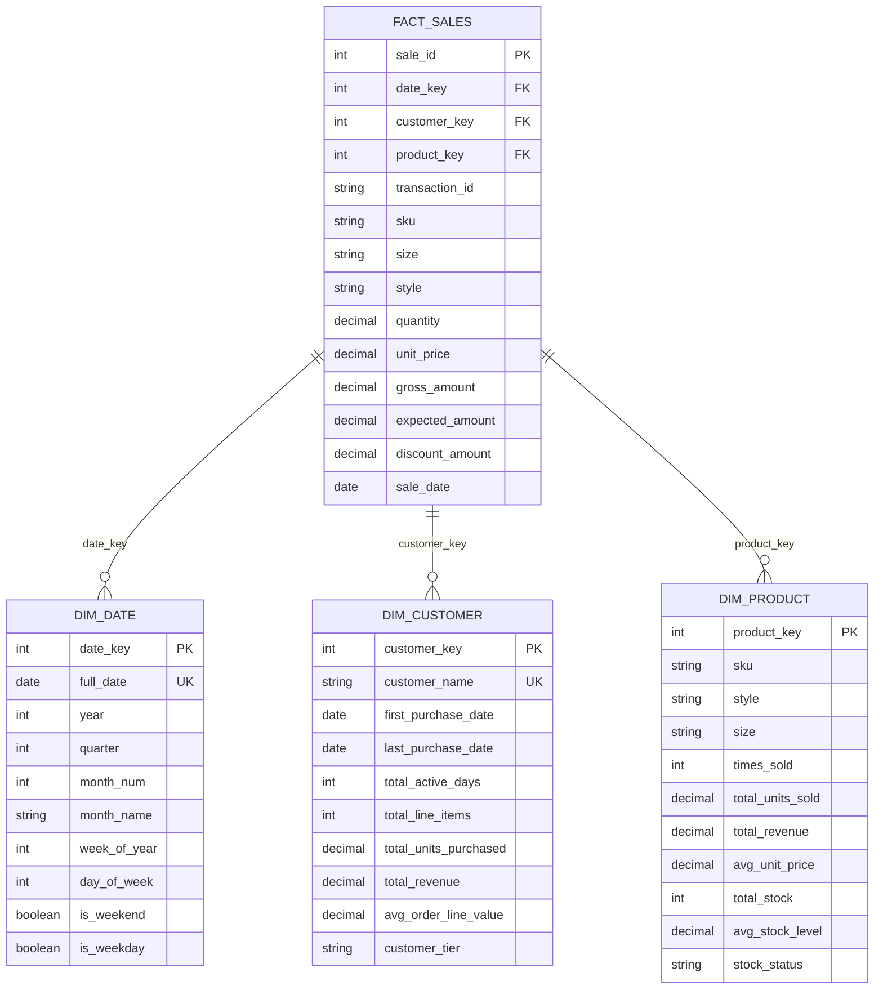

# Retail Sales Data Engineering & Analytics Platform

An end-to-end modern data engineering platform that extracts, cleans, transforms, models, tests, and orchestrates retail sales transactions and inventory datasets using **Python**, **PostgreSQL**, **dbt**, **Apache Airflow**, and **Docker**.

---

## 🏛️ Architecture Overview



---

## ⭐ Dimensional Model (Star Schema)



---

## 🛠️ Technology Stack

| Component | Technology | Purpose |
|---|---|---|
| **Containerization** | Docker & Docker Compose | Isolated multi-container environment (PostgreSQL, Airflow, pgAdmin) |
| **Database** | PostgreSQL 15 | Relational OLAP data warehouse with `raw`, `staging`, and `warehouse` schemas |
| **Ingestion / ETL** | Python 3.11 (pandas, SQLAlchemy, psycopg2) | Multi-part CSV parsing, realignment, deduplication, and bulk loading |
| **Transformation** | dbt-core 1.8 + dbt-postgres | Data staging, star schema dimensional modeling, and analytical views |
| **Testing** | dbt test suite | Primary/foreign key constraints, null checks, accepted values, and business logic tests |
| **Orchestration** | Apache Airflow 2.9 (LocalExecutor) | Scheduled daily workflow automating ETL, dbt runs, testing, and exports |
| **BI & Analytics** | Power BI / CSV Exports | Business dashboards for revenue trends, customer tiers, and inventory health |

---

## 📁 Repository Structure

```
dataeng-project/
├── docker-compose.yml              # Multi-container service definitions
├── Dockerfile.airflow              # Custom Airflow image with dbt & ETL deps
├── requirements.txt                # Local development Python dependencies
├── requirements.airflow.txt        # Airflow-safe dependencies (SQLAlchemy 1.4 compatible)
├── .env                            # Environment variables (ports, credentials)
├── .gitignore                      # Git ignore rules
├── README.md                       # Platform documentation
│
├── sql/
│   └── init/
│       └── 01_create_schemas.sql   # PostgreSQL database & schema initialization
│
├── data/
│   └── raw/
│       └── retail_sales.csv        # Source dataset
│
├── scripts/
│   ├── extract.py                  # Multi-section CSV boundary detection & extraction
│   ├── transform.py                # Schema realignment, data cleaning & normalization
│   ├── load.py                     # PostgreSQL raw schema ingestion & verification
│   ├── utils.py                    # Database connection, logging, and audit helpers
│   ├── run_etl.py                  # Main Python ETL pipeline CLI entrypoint
│   └── export_for_powerbi.py       # Automated CSV exports for Power BI
│
├── dbt_retail/
│   ├── dbt_project.yml             # dbt configuration & materializations
│   ├── profiles.yml                # PostgreSQL target connection profiles
│   ├── macros/
│   │   ├── generate_date_spine.sql # Calendar date dimension generator
│   │   └── generate_schema_name.sql# Clean schema naming override
│   ├── models/
│   │   ├── staging/
│   │   │   ├── stg_sales.sql       # Cleaned sales view
│   │   │   ├── stg_stock.sql       # Cleaned stock view
│   │   │   └── schema.yml          # Staging tests & source docs
│   │   ├── marts/
│   │   │   ├── dim_date.sql        # Date dimension table
│   │   │   ├── dim_customer.sql    # Customer dimension with RFM tiers
│   │   │   ├── dim_product.sql     # Product dimension with stock levels
│   │   │   ├── fact_sales.sql      # Central sales fact table
│   │   │   └── schema.yml          # Marts schema tests & foreign key checks
│   │   └── analytics/
│   │       ├── monthly_revenue.sql # Monthly revenue & MoM growth %
│   │       ├── top_products.sql    # SKU revenue & units ranking
│   │       ├── customer_segments.sql# Customer RFM segmentation
│   │       ├── size_distribution.sql# Sales by apparel size
│   │       ├── daily_sales_trend.sql# Daily revenue with 7-day rolling avg
│   │       └── schema.yml          # Analytics tests
│   └── tests/
│       └── assert_gross_amount_valid.sql # Custom business logic integrity test
│
├── airflow/
│   └── dags/
│       └── retail_sales_pipeline.py# End-to-end Airflow DAG
│
└── powerbi/
    └── exports/                    # Generated CSV exports for Power BI
```

---

## 🚀 Quickstart Guide

### 1. Start Infrastructure
```bash
# Clone the repository and launch Docker containers
docker-compose up -d
```

### 2. Access Web Interfaces
| Service | URL | Credentials |
|---|---|---|
| 🌀 **Airflow UI** | `http://localhost:8081` | `admin` / `admin` |
| 🐘 **pgAdmin 4** | `http://localhost:5050` | `admin@retail.com` / `admin` |
| 🗄️ **PostgreSQL** | `localhost:5433` | `retail_user` / `retail_pass_2024` (`retail_dw`) |

### 3. Run Pipeline Locally (CLI)
```bash
# 1. Run Python ETL (Extract, Clean, and Load to PostgreSQL raw schema)
python scripts/run_etl.py

# 2. Run dbt models (Staging, Marts, Analytics)
cd dbt_retail
dbt run --profiles-dir .

# 3. Execute dbt quality tests
dbt test --profiles-dir .

# 4. Export datasets for Power BI
cd ..
python scripts/export_for_powerbi.py
```

### 4. Or Run via Airflow
Open `http://localhost:8081`, navigate to `retail_sales_pipeline`, unpause the DAG, and click **Trigger DAG**.

---

## 📊 Analytics & KPI Views

1. **`warehouse.monthly_revenue`**: Month-over-Month growth, order count, active customers, total revenue.
2. **`warehouse.top_products`**: Product revenue ranking, units sold, unit prices, and inventory stock status (`In Stock`, `Low Stock`, `Out of Stock`).
3. **`warehouse.customer_segments`**: Customer tiers (`Platinum`, `Gold`, `Silver`, `Bronze`), lifetime value, active days, recency.
4. **`warehouse.size_distribution`**: Sales volume and revenue contribution percentage across clothing sizes.
5. **`warehouse.daily_sales_trend`**: Daily revenue time series with 7-day rolling averages.

---

## 🧪 Data Quality & Testing Framework

Over **70 automated tests** ensure data warehouse reliability:
- **Schema Constraints**: Unique and non-null constraints on all surrogate keys and business keys.
- **Relational Integrity**: Foreign key referential integrity checks between `fact_sales` and dimensions (`dim_date`, `dim_customer`, `dim_product`).
- **Domain Validation**: Accepted values on categorical attributes (sizes, customer tiers, stock status).
- **Business Logic Checks**: Non-negative quantities, positive gross revenue, and consistency checks.
